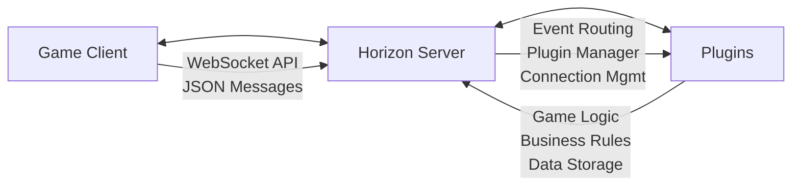

<div align="center">
  
</div>

<br>

A high-performance, plugin-driven game server built in Rust with type-safe event handling and hot-reloadable plugins.

[](https://github.com/Stars-Beyond/Horizon-Community-Edition/actions)
[](https://github.com/Stars-Beyond/Horizon-Community-Edition/actions)
[](LICENSE)

## Features

- **Type-Safe Plugin System** - Build plugins with full compile-time type checking
- **Zero Unsafe Code** - Plugin development without unsafe Rust
- **Hot Reloading** - Update plugins without server restarts
- **Event-Driven Architecture** - Clean separation between core infrastructure and game logic
- **WebSocket Support** - Real-time communication with connected clients
- **Memory Safe** - Leverages Rust's ownership system for stability
- **Cross-Platform** - Runs on Windows, Linux, and macOS
- **Docker Ready** - Containerized deployment support

## Quick Start

### Prerequisites

- [Rust](https://rustup.rs/) (1.70+)
- [Git](https://git-scm.com/)

### Installation

```bash
# Clone the repository
git clone https://github.com/Stars-Beyond/Horizon-Community-Edition.git
cd Horizon-Community-Edition

# Build the server
cargo build --release

# Run with default configuration
./target/release/horizon
```

### Using Docker

```bash
# Build and run with Docker Compose
docker-compose up --build

# Or use the pre-built image
docker run -p 8080:8080 ghcr.io/stars-beyond/horizon-community-edition:latest
```

## Configuration

Create a `config.toml` file to customize server settings:

```toml
[server]
bind_address = "127.0.0.1:8080"
max_connections = 1000
connection_timeout = 60

[server.region]
min_x = -1000.0
max_x = 1000.0
min_y = -1000.0
max_y = 1000.0
min_z = -100.0
max_z = 100.0

[plugins]
directory = "plugins"
auto_load = true
whitelist = []

[logging]
level = "info"
json_format = false
```

Run with custom configuration:

```bash
./target/release/horizon --config config.toml
```

## Plugin Development

Horizon's core server handles only infrastructure (connections, routing, plugin management). All game logic is implemented through plugins.

### Creating a Plugin

```bash
# Create new plugin crate
cargo new --lib my_plugin
cd my_plugin
```

Edit `Cargo.toml`:

```toml
[lib]
crate-type = ["cdylib"]

[dependencies]
horizon_event_system = { path = "../horizon_event_system" }
serde = { version = "1.0", features = ["derive"] }
async-trait = "0.1"
```

Basic plugin structure:

```rust
use horizon_event_system::*;
use serde::{Deserialize, Serialize};

pub struct MyPlugin {
    name: String,
}

impl MyPlugin {
    pub fn new() -> Self {
        Self { name: "my_plugin".to_string() }
    }
}

#[derive(Debug, Serialize, Deserialize)]
struct ChatMessage {
    player_id: PlayerId,
    message: String,
}

#[async_trait]
impl SimplePlugin for MyPlugin {
    fn name(&self) -> &str { &self.name }
    fn version(&self) -> &str { "1.0.0" }
    
    async fn register_handlers(&mut self, events: Arc<EventSystem>) -> Result<(), PluginError> {
        // Handle player connections
        events.on_core("player_connected", |event: serde_json::Value| {
            println!("New player connected!");
            Ok(())
        }).await?;
        
        // Handle chat messages from clients
        events.on_client("chat", "message", |msg: ChatMessage| {
            println!("Player {}: {}", msg.player_id, msg.message);
            Ok(())
        }).await?;
        
        Ok(())
    }
    
    async fn on_init(&mut self, context: Arc<dyn ServerContext>) -> Result<(), PluginError> {
        context.log(LogLevel::Info, "MyPlugin initialized!");
        Ok(())
    }
}

create_simple_plugin!(MyPlugin);
```

Build and deploy:

```bash
cargo build --release
cp target/release/libmy_plugin.so ../plugins/
```

For detailed plugin development documentation, see [Plugin Development Guide](docs/plugin-development.md).

## Event System

Horizon uses three types of events:

### Core Events
Server infrastructure events (connections, plugin lifecycle):

```rust
events.on_core("player_connected", handler).await?;
events.on_core("region_started", handler).await?;
```

### Client Events
Player actions organized by namespace:

```rust
events.on_client("chat", "message", handler).await?;
events.on_client("movement", "jump", handler).await?;
```

### Plugin Events
Inter-plugin communication:

```rust
events.on_plugin("combat", "damage_dealt", handler).await?;
events.emit_plugin("inventory", "item_used", &event).await?;
```

## Client Communication

Clients connect via WebSocket and send JSON messages:

```json
{
  "namespace": "chat",
  "event": "message",
  "data": {
    "message": "Hello world!",
    "channel": "general"
  }
}
```

## Architecture


- **Core Server**: Handles connections, message routing, plugin lifecycle
- **Plugins**: Implement all game-specific functionality
- **Event System**: Type-safe communication between components

## Examples

The repository includes example plugins:

- **Greeter Plugin** (`crates/plugin_greeter`) - Welcome messages and basic event handling
- **Logger Plugin** (`crates/plugin_logger`) - Comprehensive event logging and monitoring

## Production Deployment

### Binary Release

Download pre-built binaries from [GitHub Releases](https://github.com/Stars-Beyond/Horizon-Community-Edition/releases).

### Building from Source

```bash
# Production build
cargo build --release

# Create deployment package
./build.sh
```

### Systemd Service

```ini
[Unit]
Description=Horizon Game Server
After=network.target

[Service]
Type=simple
User=horizon
WorkingDirectory=/opt/horizon
ExecStart=/opt/horizon/bin/horizon --config /opt/horizon/config.toml
Restart=always
RestartSec=5

[Install]
WantedBy=multi-user.target
```

### Docker Deployment

```yaml
# docker-compose.yml
version: '3.8'
services:
  horizon:
    image: ghcr.io/stars-beyond/horizon-community-edition:latest
    ports:
      - "8080:8080"
    volumes:
      - ./config:/app/config
      - ./plugins:/app/plugins
    environment:
      - RUST_LOG=info
    restart: unless-stopped
```

## Performance

Horizon is designed for high performance:

- **Async/Await**: Non-blocking I/O throughout
- **Zero-Copy**: Efficient message handling
- **Memory Safe**: No garbage collection overhead
- **Hot Paths**: Optimized event routing

Typical performance characteristics:
- 10,000+ concurrent connections
- Sub-millisecond event routing
- ~50MB base memory usage
- Linear scaling with connection count

## Development

### Prerequisites

- Rust 1.70+
- Git
- Docker (optional)

### Building

```bash
# Development build
cargo build

# Run tests
cargo test

# Run with debug logging
RUST_LOG=debug cargo run

# Format code
cargo fmt

# Lint
cargo clippy
```

### Project Structure

```
├── crates/
│   ├── horizon/          # Main server executable
│   ├── game_server/      # Core server implementation
│   ├── horizon_event_system/     # Event handling framework
│   ├── plugin_system/    # Plugin loading and management
│   ├── plugin_greeter/   # Example plugin
│   └── plugin_logger/    # Example plugin
├── plugins/              # Plugin deployment directory
├── config.toml          # Server configuration
└── docker-compose.yml   # Container orchestration
```

## Roadmap

- [ ] Clustering and horizontal scaling
- [ ] More official plugins (combat, inventory, economy)
- [ ] Performance monitoring dashboard
- [ ] WebAssembly plugin support

## Contributing

We welcome contributions! Please see [CONTRIBUTING.md](CONTRIBUTING.md) for guidelines.

### Development Setup

1. Fork the repository
2. Create a feature branch
3. Make your changes
4. Add tests for new functionality
5. Ensure all tests pass
6. Submit a pull request

### Code Style

- Follow Rust standard formatting (`cargo fmt`)
- Use meaningful variable names
- Add documentation for public APIs
- Include tests for new features

## Community

- **Discord**: [Join our Discord](https://discord.gg/NM4awJWGWu)
- **GitHub Issues**: [Report bugs or request features](https://github.com/Far-Beyond-Dev/Horizon/issues)
- **Discussions**: [Community discussions](https://github.com/Far-Beyond-Dev/Horizon/discussions)

## License

Licensed under the Apache License, Version 2.0. See [LICENSE](LICENSE) for details.

## Acknowledgments

- Built with [Rust](https://www.rust-lang.org/)
- WebSocket support via [tokio-tungstenite](https://github.com/snapview/tokio-tungstenite)
- Serialization with [serde](https://serde.rs/)
- Async runtime by [Tokio](https://tokio.rs/)

---

**Horizon Community Edition** - Building the future of game servers, one plugin at a time.