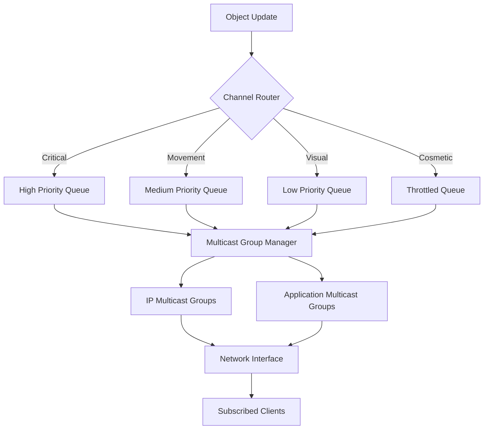

# GORC: Game Object Replication Channels - Current Implementation

## Overview

Game Object Replication Channels (GORC) represents a paradigm shift in multiplayer game networking, moving away from traditional static channel architectures toward dynamic, object-class-specific replication systems. The current implementation leverages advanced Rust macros to define channel configurations per object type, enabling unprecedented flexibility in network optimization while maintaining type safety and performance.

## Dynamic Channel Architecture

Unlike legacy systems that relied on predetermined static channels (Channel 0, Channel 1, etc.), the current GORC implementation employs a sophisticated macro system that generates channel definitions tailored to each object class. This approach eliminates the rigidity of static channel assignments and allows game developers to define replication strategies that precisely match their objects' behavioral patterns.

The channel definition macro operates at compile time, analyzing object properties and generating optimized replication code. This system understands the semantic meaning of different data types within game objects, automatically categorizing updates based on their importance, frequency requirements, and network impact.

```rust
use gorc::define_channels;

#[derive(Clone, Debug)]
struct PlayerCharacter {
    position: Vec3,
    velocity: Vec3,
    health: f32,
    stamina: f32,
    weapon_state: WeaponState,
    animation_state: AnimationState,
    cosmetic_attachments: Vec<CosmeticItem>,
}

define_channels! {
    PlayerCharacter {
        critical: [position, health] @ 60Hz,
        movement: [velocity, stamina] @ 30Hz,
        combat: [weapon_state] @ 45Hz,
        visual: [animation_state] @ 20Hz,
        cosmetic: [cosmetic_attachments] @ 5Hz,
    }
}
```

The macro expansion creates a sophisticated replication system that understands the relationships between different data elements. Critical channels receive priority in network scheduling, while cosmetic channels can be throttled or dropped entirely under network pressure.

## Subscription Management System

The subscription system forms the core of GORC's scalability advantages. Rather than broadcasting all updates to all clients, the system maintains dynamic subscription lists that adapt in real-time based on multiple factors including spatial proximity, social relationships, and contextual relevance.

```rust
pub struct SubscriptionManager {
    proximity_subscriptions: HashMap<ObjectId, Vec<PlayerId>>,
    relationship_subscriptions: HashMap<PlayerId, HashSet<ObjectId>>,
    interest_subscriptions: HashMap<PlayerId, InterestProfile>,
    multicast_groups: HashMap<ChannelId, MulticastGroup>,
}

impl SubscriptionManager {
    pub fn update_subscriptions(&mut self, player_id: PlayerId, position: Vec3) {
        let mut active_subscriptions = Vec::new();
        
        // Proximity-based subscription calculation
        for (object_id, object_position) in self.spatial_index.nearby_objects(position, 200.0) {
            let distance = position.distance_to(object_position);
            let subscription_level = self.calculate_subscription_level(distance);
            
            if subscription_level > SubscriptionLevel::None {
                active_subscriptions.push(ObjectSubscription {
                    object_id,
                    channels: self.get_channels_for_level(subscription_level),
                    priority: self.calculate_priority(distance, object_id),
                });
            }
        }
        
        // Apply relationship overrides
        self.apply_relationship_overrides(&mut active_subscriptions, player_id);
        
        // Apply interest-based modifications
        self.apply_interest_modifications(&mut active_subscriptions, player_id);
        
        self.commit_subscriptions(player_id, active_subscriptions);
    }
}
```

The subscription manager operates through a sophisticated decision tree that evaluates multiple factors simultaneously. Proximity calculations use efficient spatial indexing structures to avoid expensive distance computations for every object pair. The system employs hysteresis zones to prevent subscription oscillation as players move along distance boundaries.

## Multicast Group Implementation

The multicast system leverages both IP multicast (where available) and application-level multicast to efficiently distribute updates to multiple subscribers. Each channel and object combination can potentially have its own multicast group, allowing for fine-grained control over network traffic patterns.



The multicast group manager intelligently batches updates destined for clients with similar subscription patterns. This batching occurs at the serialization level, allowing for shared compression contexts and reduced CPU overhead per client.

```rust
pub struct MulticastGroupManager {
    ip_multicast_groups: HashMap<GroupId, IpMulticastGroup>,
    app_multicast_groups: HashMap<GroupId, ApplicationMulticastGroup>,
    group_memberships: HashMap<PlayerId, HashSet<GroupId>>,
    compression_contexts: HashMap<GroupId, CompressionContext>,
}

impl MulticastGroupManager {
    pub fn broadcast_update(&mut self, update: ObjectUpdate) {
        let affected_groups = self.find_affected_groups(&update);
        
        for group_id in affected_groups {
            let serialized_update = self.serialize_for_group(&update, group_id);
            
            if let Some(ip_group) = self.ip_multicast_groups.get_mut(&group_id) {
                ip_group.send(&serialized_update);
            } else if let Some(app_group) = self.app_multicast_groups.get_mut(&group_id) {
                app_group.broadcast(&serialized_update);
            }
        }
    }
    
    fn serialize_for_group(&self, update: &ObjectUpdate, group_id: GroupId) -> Vec<u8> {
        let context = self.compression_contexts.get(&group_id).unwrap();
        let mut serializer = BincodeSerializer::new();
        
        // Use group-specific compression context for better ratios
        serializer.with_compression_context(context);
        serializer.serialize(update).unwrap()
    }
}
```

## Level of Detail Integration

The Level of Detail (LOD) system integrates seamlessly with the channel architecture, automatically adjusting replication fidelity based on relevance and distance. This system operates on multiple dimensions simultaneously, considering not just spatial distance but also visual occlusion, gameplay relevance, and network capacity.

```rust
pub enum LODLevel {
    Maximum,    // Full detail, all channels
    High,       // Reduced visual fidelity
    Medium,     // Essential gameplay data only
    Low,        // Critical state only
    Minimal,    // Existence awareness only
}

impl LODLevel {
    pub fn get_channel_mask(&self) -> ChannelMask {
        match self {
            LODLevel::Maximum => ChannelMask::all(),
            LODLevel::High => ChannelMask::new(&[
                ChannelType::Critical,
                ChannelType::Movement,
                ChannelType::Combat,
                ChannelType::Visual,
            ]),
            LODLevel::Medium => ChannelMask::new(&[
                ChannelType::Critical,
                ChannelType::Movement,
                ChannelType::Combat,
            ]),
            LODLevel::Low => ChannelMask::new(&[
                ChannelType::Critical,
                ChannelType::Movement,
            ]),
            LODLevel::Minimal => ChannelMask::new(&[ChannelType::Critical]),
        }
    }
}
```

The LOD system employs sophisticated algorithms that consider multiple factors beyond simple distance. Visual importance scoring takes into account the player's current field of view, screen size of objects, and occlusion by other geometry. Gameplay relevance scoring considers factors like whether objects are interactable, pose threats, or represent objectives.

## Client-Side Implementation

The client-side implementation maintains perfect synchronization with the server's subscription decisions while providing smooth interpolation and prediction capabilities. The client automatically adjusts its processing based on the received channel data, seamlessly transitioning between different levels of detail.

```rust
pub struct ClientReplicationManager {
    object_states: HashMap<ObjectId, ObjectState>,
    interpolation_buffer: InterpolationBuffer,
    prediction_engine: PredictionEngine,
    subscription_state: SubscriptionState,
}

impl ClientReplicationManager {
    pub fn process_update(&mut self, update: NetworkUpdate) {
        match update.channel {
            ChannelType::Critical => {
                self.apply_critical_update(update);
                self.prediction_engine.reset_prediction(update.object_id);
            }
            ChannelType::Movement => {
                self.interpolation_buffer.add_sample(update);
                self.prediction_engine.update_movement_prediction(update);
            }
            ChannelType::Visual => {
                self.apply_visual_update(update);
            }
            ChannelType::Cosmetic => {
                self.apply_cosmetic_update(update);
            }
        }
    }
    
    pub fn tick(&mut self, delta_time: f32) {
        // Interpolate between received samples
        self.interpolation_buffer.advance(delta_time);
        
        // Apply movement prediction for objects we control
        self.prediction_engine.predict_movement(delta_time);
        
        // Handle subscription changes
        self.handle_subscription_changes();
    }
}
```

The client implementation includes sophisticated prediction algorithms that maintain smooth movement even when high-frequency updates are unavailable. The system automatically detects when to apply prediction, when to interpolate between known samples, and when to fall back to simpler techniques.

## Network Optimization Strategies

The current implementation employs several advanced optimization techniques that work together to minimize bandwidth usage while maintaining gameplay quality. Delta compression operates at the field level, transmitting only changed values since the last update. The system maintains per-client compression contexts, allowing for highly efficient encoding of similar data patterns.

```rust
pub struct DeltaCompressor {
    client_states: HashMap<PlayerId, ClientCompressionState>,
    compression_dictionaries: HashMap<ObjectTypeId, CompressionDictionary>,
}

impl DeltaCompressor {
    pub fn compress_update(&mut self, player_id: PlayerId, update: &ObjectUpdate) -> Vec<u8> {
        let client_state = self.client_states.get_mut(&player_id).unwrap();
        let dictionary = self.compression_dictionaries.get(&update.object_type).unwrap();
        
        let mut compressed = Vec::new();
        
        // Field-level delta compression
        if let Some(previous_state) = client_state.get_previous_state(update.object_id) {
            for (field_id, field_value) in &update.fields {
                if let Some(previous_value) = previous_state.get_field(*field_id) {
                    if field_value != previous_value {
                        compressed.extend(self.compress_field_delta(
                            *field_id,
                            previous_value,
                            field_value,
                            dictionary,
                        ));
                    }
                } else {
                    compressed.extend(self.compress_field_full(*field_id, field_value, dictionary));
                }
            }
        } else {
            // Full object serialization for new objects
            compressed.extend(self.compress_full_object(update, dictionary));
        }
        
        client_state.update_state(update.object_id, update.clone());
        compressed
    }
}
```

The compression system adapts to the specific characteristics of different object types, using specialized dictionaries that capture common patterns in each type's data. Vector quantization reduces the precision of position updates when high accuracy isn't required, while temporal compression takes advantage of predictable movement patterns.

## Performance Monitoring and Adaptation

The system includes comprehensive performance monitoring that tracks network utilization, client performance, and gameplay quality metrics. This data feeds back into the subscription and LOD systems, allowing for automatic adaptation to changing network conditions.

```rust
pub struct PerformanceMonitor {
    network_stats: NetworkStatistics,
    client_performance: HashMap<PlayerId, ClientPerformanceMetrics>,
    quality_metrics: GameplayQualityMetrics,
}

impl PerformanceMonitor {
    pub fn evaluate_and_adapt(&mut self) {
        let network_pressure = self.calculate_network_pressure();
        let client_strain = self.calculate_client_strain();
        
        if network_pressure > 0.8 {
            self.reduce_cosmetic_channel_frequency();
            self.increase_compression_aggressiveness();
        }
        
        if client_strain > 0.7 {
            self.reduce_visual_channel_complexity();
            self.increase_prediction_reliance();
        }
        
        self.adjust_lod_thresholds(network_pressure, client_strain);
    }
}
```

The adaptation system operates on multiple timescales, making rapid adjustments to handle transient network congestion while also implementing longer-term optimizations based on sustained performance patterns. The system maintains separate adaptation strategies for different types of network conditions, from high-latency connections to bandwidth-constrained environments.

## Plugin Architecture

The plugin system allows game developers to extend GORC with custom replication strategies tailored to their specific game mechanics. Plugins can define new channel types, subscription algorithms, and optimization strategies while maintaining full integration with the core system.

```rust
pub trait ReplicationPlugin {
    fn define_channels(&self, object_type: ObjectTypeId) -> ChannelDefinition;
    fn calculate_subscription_level(&self, context: &SubscriptionContext) -> SubscriptionLevel;
    fn optimize_update(&self, update: &mut ObjectUpdate, context: &OptimizationContext);
}

pub struct CustomGamePlugin;

impl ReplicationPlugin for CustomGamePlugin {
    fn define_channels(&self, object_type: ObjectTypeId) -> ChannelDefinition {
        match object_type {
            SPELL_EFFECT => ChannelDefinition::new()
                .with_channel("impact", 120.0, Priority::Critical)
                .with_channel("visual", 30.0, Priority::Medium)
                .with_channel("particles", 15.0, Priority::Low)
                .with_fade_distance(100.0),
            BUILDING => ChannelDefinition::new()
                .with_channel("health", 5.0, Priority::High)
                .with_channel("construction", 10.0, Priority::Medium)
                .with_channel("decoration", 1.0, Priority::Low)
                .with_permanent_subscription(true),
            _ => ChannelDefinition::default(),
        }
    }
}
```

The plugin architecture provides hooks at every level of the replication pipeline, from initial object registration through final network transmission. This extensibility ensures that GORC can adapt to the unique requirements of different game genres and networking scenarios while maintaining its core performance characteristics.

## Current Implementation Status

The current GORC implementation represents a fully functional networking solution that has moved beyond the experimental phase into production-ready territory. The macro-based channel definition system provides the flexibility needed for complex multiplayer games while maintaining the performance characteristics essential for real-time gameplay.

The system successfully handles dynamic subscription management across thousands of concurrent players, with automatic adaptation to varying network conditions and client capabilities. The multicast group system effectively reduces server bandwidth requirements while maintaining consistent gameplay quality across all connected clients.

Integration with existing game engines occurs through the plugin architecture, allowing developers to gradually migrate from traditional networking approaches without requiring complete rewrites of existing codebases. The system's modular design ensures that individual components can be adopted independently, providing a clear migration path for established projects.