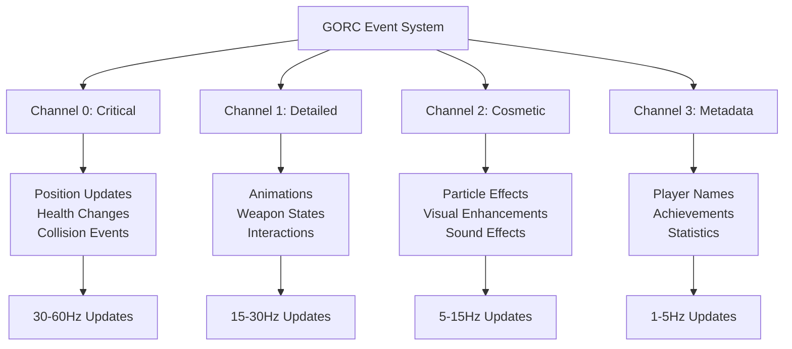
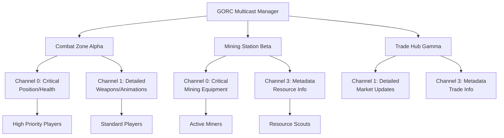
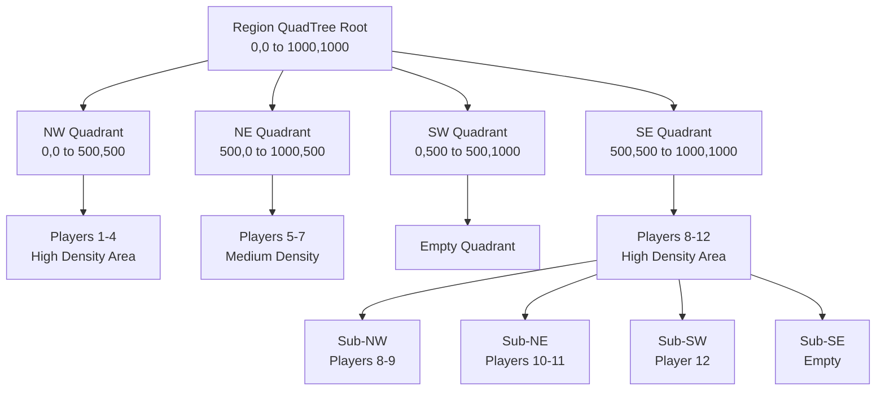

# GORC (Game Object Replication Channels) Documentation

## Table of Contents

1. [Overview](#overview)
2. [Channel Architecture](#channel-architecture)
   - [Static Channel Implementation](#static-channel-implementation)
3. [Core Components and Data Structures](#core-components-and-data-structures)
   - [ReplicationLayer](#replicationlayer)
   - [ReplicationChannel Management](#replicationchannel-management)
   - [Compression and Priority Systems](#compression-and-priority-systems)
4. [Object Registration and Replication Implementation](#object-registration-and-replication-implementation)
   - [Implementing the Replication Trait](#implementing-the-replication-trait)
   - [Object Registry and Management](#object-registry-and-management)
5. [Subscription Management System](#subscription-management-system)
   - [Proximity-Based Subscriptions](#proximity-based-subscriptions)
   - [Relationship-Based Subscriptions](#relationship-based-subscriptions)
   - [Interest-Based Subscriptions](#interest-based-subscriptions)
   - [Integrated Subscription Coordination](#integrated-subscription-coordination)
6. [Multicast Distribution and LOD Management](#multicast-distribution-and-lod-management)
   - [Multicast Group Architecture](#multicast-group-architecture)
   - [Level of Detail (LOD) Room System](#level-of-detail-lod-room-system)
7. [Spatial Partitioning and Query Systems](#spatial-partitioning-and-query-systems)
   - [QuadTree Spatial Indexing](#quadtree-spatial-indexing)
   - [Advanced Spatial Queries](#advanced-spatial-queries)
   - [Multi-Region Spatial Management](#multi-region-spatial-management)
8. [Event System Integration](#event-system-integration)
   - [GORC Event Processing](#gorc-event-processing)
   - [Event Emission and Distribution](#event-emission-and-distribution)
   - [Plugin Integration Patterns](#plugin-integration-patterns)
9. [Performance Monitoring and Statistics](#performance-monitoring-and-statistics)
   - [Channel-Level Statistics](#channel-level-statistics)
   - [Global GORC System Statistics](#global-gorc-system-statistics)
   - [Subscription System Performance](#subscription-system-performance)
   - [Spatial Partitioning Performance](#spatial-partitioning-performance)
10. [Configuration and Optimization Strategies](#configuration-and-optimization-strategies)
    - [Channel Configuration Strategies](#channel-configuration-strategies)
    - [Subscription Optimization Patterns](#subscription-optimization-patterns)
    - [Spatial Partitioning Tuning](#spatial-partitioning-tuning)
11. [Implementation Notes and Current Limitations](#implementation-notes-and-current-limitations)
    - [Static Channel System](#static-channel-system)
    - [Compression System Implementation Status](#compression-system-implementation-status)
    - [Event System Integration Patterns](#event-system-integration-patterns)
12. [Best Practices and Recommendations](#best-practices-and-recommendations)
    - [Channel Assignment Strategy](#channel-assignment-strategy)
    - [Subscription Pattern Optimization](#subscription-pattern-optimization)
    - [Performance Monitoring Integration](#performance-monitoring-integration)

## Overview

GORC is an advanced replication system designed for managing complex multiplayer game state distribution in high-performance game servers. The system provides fine-grained control over what information reaches which players and at what frequency through a sophisticated multi-channel architecture. Unlike traditional replication systems that treat all data equally, GORC recognizes that different types of game information have varying importance levels and update requirements, allowing developers to optimize network usage while maintaining responsive gameplay.

The core philosophy behind GORC is that not all game data needs to be transmitted at the same frequency or with the same priority. Critical gameplay information like player positions and health should be transmitted frequently and with high priority, while cosmetic effects and metadata can be transmitted less frequently without impacting gameplay quality. This approach dramatically reduces network bandwidth requirements while ensuring that players receive the most important information as quickly as possible.

## Channel Architecture

GORC organizes replication into four distinct channels, each designed for different types of game data with specific characteristics and requirements. This static channel system provides a well-defined framework that game developers can rely on for consistent performance characteristics.



**Channel 0 (Critical)** handles the most essential game state information that directly impacts gameplay mechanics. This includes player positions, health values, collision events, and other data that must be delivered immediately to maintain fair and responsive gameplay. The channel operates at 30-60Hz to ensure minimal latency for critical updates. Any delays or packet loss in this channel directly affect the player experience, so it receives the highest network priority and uses the most aggressive retry mechanisms.

**Channel 1 (Detailed)** manages important non-critical information that enhances the gameplay experience but doesn't require instant delivery. This includes character animations, weapon state changes, and player interactions. Operating at 15-30Hz, this channel provides smooth visual feedback while being more tolerant of occasional delays. The channel uses moderate compression to balance update frequency with bandwidth efficiency.

**Channel 2 (Cosmetic)** focuses on visual enhancements that improve immersion but don't affect gameplay mechanics. Particle effects, environmental animations, and decorative elements are transmitted through this channel at 5-15Hz. Since these updates are primarily aesthetic, the system can safely drop packets or delay updates when network conditions are poor without impacting core gameplay.

**Channel 3 (Metadata)** handles informational data that changes infrequently but provides context and social features. Player names, achievement notifications, leaderboard updates, and other persistent information flow through this channel at 1-5Hz. The low frequency allows for higher compression ratios and more complex data structures without affecting real-time performance.

### Static Channel Implementation

The current implementation uses a static channel approach where the four channels are predefined with fixed characteristics. This design provides predictable performance and simplifies client-side processing since all clients understand the same channel structure. The static nature allows for aggressive optimizations in the networking layer, as the system can pre-allocate buffers and optimize packet structures for each channel type.

```rust
use horizon_event_system::*;

// Static channel configuration - these are built into the system
let critical_layer = ReplicationLayer::new(
    0,                                    // Channel 0 (Critical)
    100.0,                               // 100 unit radius
    60.0,                                // 60Hz frequency
    vec!["position".to_string(), "health".to_string()], // Properties to replicate
    CompressionType::Delta,              // Use delta compression for efficiency
);

let detailed_layer = ReplicationLayer::new(
    1,                                    // Channel 1 (Detailed)  
    250.0,                               // 250 unit radius
    30.0,                                // 30Hz frequency
    vec!["animation".to_string(), "weapon_state".to_string()],
    CompressionType::Lz4,                // Balanced compression
);
```

The static approach also enables sophisticated client prediction and interpolation systems, as clients can reliably expect certain types of data to arrive with predictable timing characteristics. This predictability is crucial for maintaining smooth gameplay in networked environments where latency and packet loss are inevitable factors.

## Core Components and Data Structures

### ReplicationLayer

The ReplicationLayer represents the fundamental unit of the GORC system, defining how specific properties of game objects are replicated across the network. Each layer encapsulates not just what data to send, but how often to send it, how far it should travel, and what compression techniques to apply. This granular control allows developers to fine-tune network performance for different aspects of their game objects.

```rust
let position_layer = ReplicationLayer::new(
    0,                                    // Critical channel for immediate delivery
    50.0,                                // 50 unit radius - only nearby players receive updates
    30.0,                                // 30Hz update frequency for smooth movement
    vec!["position".to_string(), "velocity".to_string(), "health".to_string()],
    CompressionType::Delta,              // Only send changes from previous state
);

// Access layer properties
let update_interval = position_layer.update_interval(); // Duration between updates
let priority = position_layer.priority;                 // ReplicationPriority::Critical
```

The layer system allows for sophisticated optimization strategies. For example, a player character might have multiple layers: a critical layer for position and health that updates frequently with a small radius, a detailed layer for animations that updates moderately with a medium radius, and a metadata layer for the player's name and guild that updates rarely but with a large radius. This multi-layer approach ensures that each type of information is distributed with appropriate efficiency and priority.

### ReplicationChannel Management

ReplicationChannel provides the infrastructure for managing groups of related replication layers, tracking performance statistics, and coordinating update scheduling. Each channel maintains its own state and can be configured independently to match the requirements of different game scenarios.

```rust
let mut critical_channel = ReplicationChannel::new(
    0,                                   // Channel ID
    "Critical".to_string(),              // Human-readable name
    "Essential game state for immediate gameplay decisions".to_string(),
    (30.0, 60.0),                       // Frequency range (min 30Hz, max 60Hz)
);

critical_channel.add_layer(position_layer);

// Check if channel is ready for next update cycle
if critical_channel.is_ready_for_update() {
    // Process pending updates for this channel
    critical_channel.mark_updated();    // Record the update in statistics
}
```

The channel system includes built-in flow control mechanisms to prevent network congestion. When network conditions degrade, channels can automatically reduce their update frequencies within their configured ranges, prioritizing critical channels over cosmetic ones. This adaptive behavior helps maintain playability even under adverse network conditions.

### Compression and Priority Systems

GORC implements multiple compression strategies to optimize bandwidth usage for different types of data. The compression system recognizes that different game data has different characteristics and chooses appropriate algorithms accordingly.

```rust
pub enum CompressionType {
    None,           // No compression - fastest processing, largest packets
    Lz4,           // Fast compression with good ratio - ideal for general use
    Zlib,          // Higher compression ratio but slower - good for large payloads
    Delta,         // Send only changes from previous state - excellent for position data
    Quantized,     // Reduce precision to save space - useful for approximate data
    High,          // Maximum compression for bandwidth-limited scenarios
    Custom(u8),    // Game-specific compression algorithms
}

pub enum ReplicationPriority {
    Critical = 0,  // Must be delivered immediately - bypasses queues
    High = 1,      // Important data with elevated priority
    Normal = 2,    // Standard priority for most game data
    Low = 3,       // Can be delayed or dropped under pressure
}
```

The delta compression system is particularly sophisticated, maintaining state snapshots for each client connection and computing minimal difference packets. This approach is especially effective for position data, where small movements can be encoded in just a few bytes rather than transmitting complete coordinate sets. The quantized compression reduces floating-point precision for data where perfect accuracy isn't required, such as cosmetic particle positions.

## Object Registration and Replication Implementation

### Implementing the Replication Trait

Game objects become part of the GORC system by implementing the Replication trait, which defines how the object should be divided into replication layers and how it should prioritize updates based on observer distance. This design allows each object type to have completely customized replication behavior while still integrating seamlessly with the overall system.

```rust
use horizon_event_system::*;
use serde::{Serialize, Deserialize};

#[derive(Clone, Debug, Serialize, Deserialize)]
struct Asteroid {
    pub radius: i32,
    pub position: Vec3,
    pub velocity: Vec3, 
    pub health: f32,
    pub mineral_type: MineralType,
    pub rotation_speed: f32,
}

impl Replication for Asteroid {
    fn init_layers() -> ReplicationLayers {
        ReplicationLayers::new()
            // Critical layer for collision-relevant data
            .add_layer(ReplicationLayer::new(
                0,                       // Critical channel
                50.0,                    // Close range only
                30.0,                    // High frequency
                vec!["position".to_string(), "velocity".to_string(), "health".to_string()],
                CompressionType::Delta,  // Efficient for frequently changing data
            ))
            // Detailed layer for visual feedback
            .add_layer(ReplicationLayer::new(
                1,                       // Detailed channel
                150.0,                   // Medium range
                15.0,                    // Moderate frequency
                vec!["position".to_string(), "rotation_speed".to_string()],
                CompressionType::Lz4,    // Good general-purpose compression
            ))
            // Metadata layer for strategic information
            .add_layer(ReplicationLayer::new(
                3,                       // Metadata channel
                1000.0,                  // Long range for strategic planning
                5.0,                     // Low frequency
                vec!["mineral_type".to_string(), "radius".to_string()],
                CompressionType::High,   // Maximum compression for infrequent data
            ))
    }
    
    fn get_priority(&self, observer_pos: Vec3) -> ReplicationPriority {
        let distance = self.position.distance(observer_pos);
        
        // Dynamic priority based on relevance to observer
        if distance < 50.0 {
            ReplicationPriority::Critical  // Close asteroids affect immediate gameplay
        } else if distance < 150.0 {
            ReplicationPriority::High      // Medium distance - important for planning
        } else if distance < 500.0 {
            ReplicationPriority::Normal    // Far but visible - normal updates
        } else {
            ReplicationPriority::Low       // Very distant - minimal updates needed
        }
    }
    
    fn serialize_for_layer(&self, layer: &ReplicationLayer) -> Result<Vec<u8>, Box<dyn std::error::Error>> {
        let mut data = serde_json::Map::new();
        
        // Only serialize properties relevant to this layer
        for property in &layer.properties {
            match property.as_str() {
                "position" => {
                    data.insert("position".to_string(), serde_json::to_value(&self.position)?);
                }
                "velocity" => {
                    data.insert("velocity".to_string(), serde_json::to_value(&self.velocity)?);
                }
                "health" => {
                    data.insert("health".to_string(), serde_json::to_value(self.health)?);
                }
                "mineral_type" => {
                    data.insert("mineral_type".to_string(), serde_json::to_value(&self.mineral_type)?);
                }
                "rotation_speed" => {
                    data.insert("rotation_speed".to_string(), serde_json::to_value(self.rotation_speed)?);
                }
                "radius" => {
                    data.insert("radius".to_string(), serde_json::to_value(self.radius)?);
                }
                _ => {} // Ignore unknown properties
            }
        }
        
        Ok(serde_json::to_vec(&data)?)
    }
}

// Register the object type with GORC system
defObject!(Asteroid);
```

The layered approach allows the same object to participate in multiple replication streams simultaneously. An asteroid might send position updates to nearby players at 30Hz through the critical channel, while sending mineral type information to all players in a large radius at 5Hz through the metadata channel. This flexibility enables rich, detailed game worlds without overwhelming the network infrastructure.

### Object Registry and Management

The GorcObjectRegistry provides centralized management of all registered object types, maintaining their replication layer configurations and providing runtime access to this information. This system enables dynamic plugin loading where new object types can be registered at runtime without recompiling the core server.

```rust
#[tokio::main]
async fn main() -> Result<(), Box<dyn std::error::Error>> {
    let registry = Arc::new(GorcObjectRegistry::new());
    
    // Register object types - can be done dynamically as plugins load
    Asteroid::register_with_gorc(registry.clone()).await?;
    
    // Query registration information
    let object_types = registry.list_objects().await;
    println!("Registered GORC object types: {:?}", object_types);
    
    // Access layer configuration for runtime optimization
    if let Some(layers) = registry.get_layers("Asteroid").await {
        println!("Asteroid uses {} replication layers", layers.len());
        for (i, layer) in layers.iter().enumerate() {
            println!("Layer {}: Channel {}, {}Hz, {} properties", 
                i, layer.channel, layer.frequency, layer.properties.len());
        }
    }
    
    // Monitor registry statistics
    let stats = registry.get_stats().await;
    println!("Registry managing {} object types with {} total layers",
        stats.registered_objects, stats.total_layers);
    
    Ok(())
}
```

The registry system supports hot-swapping of object configurations, allowing developers to tune replication parameters without server restarts. This capability is invaluable during development and live operations, where network conditions and player behavior patterns may require replication adjustments.

## Subscription Management System

GORC implements a sophisticated subscription management system that determines which players should receive updates about which objects. Rather than broadcasting all information to all players, the system intelligently filters updates based on multiple criteria to minimize bandwidth usage while ensuring players receive relevant information.

### Proximity-Based Subscriptions

The foundation of the subscription system is proximity-based filtering, which ensures players primarily receive updates about nearby objects that directly affect their gameplay experience. This system uses configurable radius settings for each replication channel, allowing critical information to travel shorter distances with higher frequency while less important information can travel further with lower frequency.

```rust
let mut proximity_sub = ProximitySubscription::new(Position::new(0.0, 0.0, 0.0));

// Different channels have different effective ranges
// Channel 0 (Critical): 100 units - immediate gameplay area
// Channel 1 (Detailed): 250 units - visual feedback area  
// Channel 2 (Cosmetic): 500 units - atmospheric effects area
// Channel 3 (Metadata): 1000 units - strategic information area

// Update player position with movement threshold
if proximity_sub.update_position(Position::new(15.0, 5.0, 0.0)) {
    println!("Moved beyond threshold, recalculating subscriptions");
    // This triggers subscription updates for all relevant objects
}

// Check subscription ranges for different channels
let target_position = Position::new(80.0, 0.0, 0.0);
if proximity_sub.is_in_range(target_position, 0) {
    println!("Target is within critical channel range");
}
if proximity_sub.is_in_range(target_position, 1) {
    println!("Target is within detailed channel range");
}
```

The proximity system includes intelligent hysteresis to prevent subscription thrashing when players move along the boundaries of subscription ranges. Rather than immediately subscribing and unsubscribing as players cross exact distance thresholds, the system uses slightly different ranges for subscription and unsubscription, creating stable subscription patterns even with constant movement.

### Relationship-Based Subscriptions

Beyond simple distance-based filtering, GORC supports relationship-based subscriptions that ensure players receive enhanced information about teammates, guild members, friends, and other socially connected players regardless of distance. This system recognizes that multiplayer games are fundamentally social experiences where player relationships should influence information flow.

```rust
// Team relationships get enhanced priority across all channels
let mut team_sub = RelationshipSubscription::new("team".to_string());
team_sub.add_player(teammate1_id);
team_sub.add_player(teammate2_id);

// Team members receive critical updates at extended range
let team_priority = team_sub.get_channel_priority(0); // Critical channel
assert_eq!(team_priority, ReplicationPriority::Critical);

// Guild relationships provide moderate enhancements
let mut guild_sub = RelationshipSubscription::new("guild".to_string());
guild_sub.add_player(guild_member_id);
let guild_priority = guild_sub.get_channel_priority(3); // Metadata channel
assert_eq!(guild_priority, ReplicationPriority::Normal);

// Friend relationships enhance social features
let mut friend_sub = RelationshipSubscription::new("friend".to_string());
friend_sub.add_player(friend_id);
// Friends get enhanced metadata updates for social features
let friend_meta_priority = friend_sub.get_channel_priority(3);
assert_eq!(friend_meta_priority, ReplicationPriority::High);
```

The relationship system supports hierarchical priority structures where team relationships override guild relationships, which in turn override friend relationships. This ensures that the most important social connections receive the highest priority when network bandwidth is limited.

### Interest-Based Subscriptions

The most sophisticated aspect of the subscription system is interest-based filtering, which tracks player behavior patterns to predict what information they're most likely to need. This system learns from player actions and focus patterns to proactively subscribe to relevant information streams.

```rust
let mut interest_sub = InterestSubscription::new();

// Track explicit interest in specific objects
interest_sub.record_interest("weapon_plasma_rifle".to_string(), InterestLevel::High);
interest_sub.record_interest("asteroid_mining_zone".to_string(), InterestLevel::Medium);

// Track focus area - where the player is looking or moving toward
interest_sub.update_focus(Position::new(200.0, 100.0, 50.0), 75.0);

// Record activity patterns for predictive subscriptions
interest_sub.record_activity("mining".to_string(), Duration::from_secs(300)); // 5 minute mining session
interest_sub.record_activity("combat".to_string(), Duration::from_secs(45));  // 45 second combat

// Query interest levels for subscription decisions
let weapon_interest = interest_sub.get_interest_level("weapon_plasma_rifle");
if weapon_interest == InterestLevel::High {
    // Subscribe to detailed weapon state updates
}

// Check if objects are in the player's focus area
if interest_sub.is_in_focus(Position::new(190.0, 110.0, 45.0)) {
    // Object is in focus - increase subscription priority
}
```

The interest system builds behavioral profiles over time, learning that players who spend significant time mining are likely interested in asteroid composition updates, while players who frequently engage in combat need enhanced weapon and shield state information. This predictive capability allows the system to preemptively subscribe to information streams before the player explicitly needs them.

### Integrated Subscription Coordination

The SubscriptionManager coordinates all three subscription types to create a unified, intelligent filtering system that maximizes the relevance of transmitted information while respecting bandwidth constraints.

```rust
let manager = SubscriptionManager::new();

// Add players to the subscription system
manager.add_player(player_id, Position::new(100.0, 100.0, 0.0)).await;

// Establish social relationships
manager.add_relationship(
    player_id,
    "team".to_string(),
    vec![teammate1_id, teammate2_id, teammate3_id],
).await;

// Update interest tracking
manager.update_interest(player_id, "asteroid_belt_alpha".to_string(), InterestLevel::High).await;

// Get combined subscription priority considering all factors
let combined_priority = manager.get_subscription_priority(
    subscriber_id,    // Who wants the information
    target_player_id, // Who the information is about
    1,               // Channel 1 (Detailed)
).await;

// The priority combines proximity, relationship, and interest factors
match combined_priority {
    ReplicationPriority::Critical => {
        // Send immediately with highest network priority
    }
    ReplicationPriority::High => {
        // Send with elevated priority, minimal delay
    }
    ReplicationPriority::Normal => {
        // Send with standard scheduling
    }
    ReplicationPriority::Low => {
        // Send when bandwidth is available, may be delayed
    }
}
```

The integration system uses weighted algorithms to combine the different subscription factors. Proximity provides the base subscription level, relationships can enhance or maintain subscriptions beyond normal range, and interest patterns can boost priority within existing subscriptions. This multi-factor approach ensures that the most relevant information reaches players with appropriate priority and frequency.

## Multicast Distribution and LOD Management

GORC implements sophisticated distribution mechanisms that group players with similar information needs and manage detail levels automatically based on distance and importance. This approach dramatically reduces server processing overhead compared to individual point-to-point updates while maintaining personalized information delivery.

### Multicast Group Architecture



Multicast groups enable efficient distribution of identical information to multiple players simultaneously, reducing server CPU usage and network traffic. The system dynamically creates and manages groups based on player locations, activities, and interests.

```rust
let manager = MulticastManager::new();

// Create specialized multicast groups for different game areas
let combat_channels = vec![0, 1].into_iter().collect(); // Critical + Detailed for combat
let combat_group_id = manager.create_group(
    "combat_zone_alpha".to_string(),
    combat_channels,
    ReplicationPriority::High,
).await;

let mining_channels = vec![0, 3].into_iter().collect(); // Critical + Metadata for mining
let mining_group_id = manager.create_group(
    "mining_station_beta".to_string(), 
    mining_channels,
    ReplicationPriority::Normal,
).await;

// Add players to appropriate groups based on their activities
manager.add_player_to_group(combat_player_id, combat_group_id).await;
manager.add_player_to_group(mining_player_id, mining_group_id).await;

// Broadcast updates efficiently to entire groups
let combat_update = b"enemy position update in sector 7";
let recipients = manager.broadcast_to_group(combat_group_id, combat_update, 0).await?;
println!("Combat update sent to {} players", recipients);

// Groups automatically handle channel filtering
let mining_metadata = b"new asteroid composition detected";
manager.broadcast_to_group(mining_group_id, mining_metadata, 3).await?;
```

The multicast system includes sophisticated membership management that automatically adds and removes players from groups based on their current activities, locations, and subscription patterns. Players can belong to multiple groups simultaneously, allowing for overlapping information delivery when appropriate.

### Level of Detail (LOD) Room System

LOD rooms provide automatic detail management based on distance, ensuring that players receive appropriate levels of information without manual configuration. The system creates nested spatial regions where closer players receive more detailed information while distant players receive only essential updates.

```rust
// Create a hierarchical LOD room structure
let mut main_lod_room = LodRoom::new(
    Position::new(0.0, 0.0, 0.0),    // Center of the area
    LodLevel::Medium,                 // Base detail level
);

// Add nested rooms for higher detail levels
let high_detail_room = LodRoom::new(
    Position::new(0.0, 0.0, 0.0),
    LodLevel::High,                   // 150 unit radius, 30Hz updates
);

let ultra_detail_room = LodRoom::new(
    Position::new(0.0, 0.0, 0.0), 
    LodLevel::Ultra,                  // 50 unit radius, 60Hz updates
);

main_lod_room.add_nested_room(high_detail_room);
main_lod_room.add_nested_room(ultra_detail_room);

// Players are automatically placed in appropriate detail levels
main_lod_room.add_member(player1_id, Position::new(25.0, 0.0, 0.0));  // Ultra detail
main_lod_room.add_member(player2_id, Position::new(100.0, 0.0, 0.0)); // High detail  
main_lod_room.add_member(player3_id, Position::new(250.0, 0.0, 0.0)); // Medium detail

// Automatic transitions as players move
main_lod_room.update_member_position(player1_id, Position::new(75.0, 0.0, 0.0));
// Player1 automatically transitions from Ultra to High detail level
```

The LOD system includes intelligent hysteresis settings that prevent rapid oscillation between detail levels when players move along boundaries. The system uses different thresholds for entering and exiting detail levels, creating stable subscription patterns that enhance both performance and user experience.

```rust
pub enum LodLevel {
    Ultra = 0,    // 50 unit radius, 60Hz updates - immediate vicinity
    High = 1,     // 150 unit radius, 30Hz updates - close interaction range
    Medium = 2,   // 300 unit radius, 15Hz updates - visual range
    Low = 3,      // 600 unit radius, 7.5Hz updates - awareness range
    Minimal = 4,  // 1200 unit radius, 3Hz updates - strategic information
}

// Each level automatically provides appropriate update frequency and compression
let level = LodLevel::High;
let frequency = level.frequency();      // 30.0 Hz
let radius = level.radius();           // 150.0 units
let priority = level.to_priority();    // ReplicationPriority::High
```

The LOD room system integrates seamlessly with the multicast groups, automatically creating and managing specialized multicast groups for each detail level. This integration ensures that the benefits of both systems combine effectively, providing highly optimized information distribution.

## Spatial Partitioning and Query Systems

Efficient spatial management is crucial for GORC's performance, especially in large game worlds with thousands of objects and players. The system implements advanced spatial partitioning using quadtree structures that enable fast proximity queries and subscription calculations.

### QuadTree Spatial Indexing



The spatial partitioning system uses adaptive quadtrees that automatically subdivide regions based on player density. Areas with many players are subdivided into smaller regions for efficient queries, while sparsely populated areas remain as larger regions to minimize memory overhead.

```rust
let region_bounds = RegionBounds {
    min_x: 0.0, max_x: 1000.0,
    min_y: 0.0, max_y: 1000.0, 
    min_z: 0.0, max_z: 1000.0,
};

let mut quadtree = RegionQuadTree::new(region_bounds);

// Add players to the spatial index
quadtree.upsert_player(player1_id, Position::new(100.0, 150.0, 200.0));
quadtree.upsert_player(player2_id, Position::new(300.0, 450.0, 100.0));
quadtree.upsert_player(player3_id, Position::new(750.0, 200.0, 600.0));

// Efficient radius queries for subscription calculations
let query_center = Position::new(200.0, 200.0, 200.0);
let nearby_players = quadtree.query_radius(query_center, 150.0);

for result in nearby_players {
    println!("Player {} at distance {:.1}", result.player_id, result.distance);
    // Use distance to determine appropriate replication priority
}
```

The quadtree implementation includes sophisticated optimization features such as spatial locality preservation, cache-friendly memory layouts, and predictive subdivision that anticipates player movement patterns. These optimizations ensure that spatial queries remain fast even in dense player clusters or rapidly changing scenarios.

### Advanced Spatial Queries

The spatial query system supports complex filtering and search patterns that enable sophisticated subscription logic. Rather than simple radius-based queries, the system supports multi-criteria searches that can filter results based on relationships, interests, and other game-specific factors.

```rust
// Create a complex spatial query with multiple filters
let team_members: HashSet<PlayerId> = vec![teammate1_id, teammate2_id].into_iter().collect();
let query = SpatialQuery {
    center: Position::new(300.0, 300.0, 300.0),
    radius: 200.0,
    filters: QueryFilters {
        max_results: Some(10),           // Limit results for performance
        min_distance: Some(25.0),        // Exclude very close objects
        include_players: Some(team_members), // Only team members
        exclude_players: None,           // No specific exclusions
    },
};

let filtered_results = quadtree.query(&query);
for result in filtered_results {
    println!("Team member {} at distance {:.1}", result.player_id, result.distance);
    // Enhanced subscription priority for team members
}
```

The query system integrates with the subscription management to provide real-time spatial awareness for all subscription decisions. When players move, the system efficiently recalculates affected subscriptions without requiring full spatial rebuilds.

### Multi-Region Spatial Management

For large game worlds spanning multiple regions, GORC provides a spatial partition manager that coordinates multiple quadtrees and handles cross-region queries seamlessly.

```rust
let partition = SpatialPartition::new();

// Add multiple game regions with their own spatial characteristics
partition.add_region("combat_zone".to_string(), combat_bounds).await;
partition.add_region("mining_sector".to_string(), mining_bounds).await;
partition.add_region("trade_hub".to_string(), trade_bounds).await;

// Players can move between regions seamlessly
partition.update_player_position(
    player_id,
    Position::new(500.0, 300.0, 200.0),
    "combat_zone".to_string(),
).await;

// Cross-region queries for players near region boundaries
let cross_region_results = partition.get_nearby_players(
    Position::new(999.0, 500.0, 500.0), // Near region boundary
    100.0,                               // Search radius spans regions
    Some(20),                           // Limit results
).await;

// System automatically queries relevant regions and merges results
for result in cross_region_results {
    println!("Cross-region player {} at distance {:.1}", result.player_id, result.distance);
}
```

The multi-region system handles complex scenarios such as players standing near region boundaries who need to receive updates from multiple regions simultaneously. The partition manager automatically determines which regions need to be queried and efficiently merges results while maintaining distance-based sorting and filtering.

## Event System Integration

GORC integrates seamlessly with the broader Horizon Event System, providing specialized event types for object replication while maintaining compatibility with the general event architecture. This integration allows GORC to leverage the event system's reliability, performance, and plugin ecosystem.

### GORC Event Processing

The GORC event system extends the base event architecture with specialized handling for object replication events. These events carry additional metadata about replication channels, priorities, and spatial context that enables sophisticated routing and filtering decisions.

```rust
use horizon_event_system::*;

// Register handlers for specific object types and channels
events.on_gorc("Asteroid", 0, "position_update", |event: GorcEvent| {
    println!("Critical asteroid position update for {}", event.object_id);
    
    // Parse the position data with appropriate error handling
    if let Ok(position_data) = serde_json::from_slice::<serde_json::Value>(&event.data) {
        if let Some(position) = position_data.get("position") {
            // Process position update with critical priority
            process_critical_position_update(&event.object_id, position)?;
        }
    }
    
    Ok(())
}).await?;

// Handle detailed channel updates for visual feedback
events.on_gorc("Asteroid", 1, "rotation_update", |event: GorcEvent| {
    println!("Asteroid {} rotation update on detailed channel", event.object_id);
    
    // Lower priority processing for visual updates
    if let Ok(rotation_data) = serde_json::from_slice::<serde_json::Value>(&event.data) {
        update_asteroid_visual_state(&event.object_id, &rotation_data)?;
    }
    
    Ok(())
}).await?;

// Metadata channel for strategic information
events.on_gorc("Asteroid", 3, "composition_discovered", |event: GorcEvent| {
    println!("New mineral composition discovered in {}", event.object_id);
    
    // Process discovery information for strategic planning
    if let Ok(composition_data) = serde_json::from_slice::<serde_json::Value>(&event.data) {
        update_strategic_information(&event.object_id, &composition_data)?;
    }
    
    Ok(())
}).await?;
```

The event handlers can be registered with varying levels of specificity, from broad object type handlers that process all events for a type, to highly specific handlers that only process particular event types on specific channels. This flexibility allows plugins to subscribe to exactly the information they need without processing irrelevant updates.

### Event Emission and Distribution

GORC events are emitted through the same reliable infrastructure as other event types, but with additional routing logic that considers spatial relationships, subscription patterns, and network priorities.

```rust
// Emit a critical position update that will be distributed based on subscriptions
let position_data = serde_json::json!({
    "position": {"x": 150.0, "y": 200.0, "z": 300.0},
    "velocity": {"x": 5.0, "y": 0.0, "z": -2.0}
});

events.emit_gorc("Asteroid", 0, "position_update", &GorcEvent {
    object_id: "asteroid_mining_001".to_string(),
    object_type: "Asteroid".to_string(),
    channel: 0,
    data: serde_json::to_vec(&position_data)?,
    priority: "Critical".to_string(),
    timestamp: current_timestamp(),
}).await?;

// Emit a metadata update with wider distribution but lower priority
let composition_data = serde_json::json!({
    "mineral_type": "Platinum",
    "purity": 0.85,
    "estimated_yield": 15000
});

events.emit_gorc("Asteroid", 3, "composition_update", &GorcEvent {
    object_id: "asteroid_mining_001".to_string(),
    object_type: "Asteroid".to_string(), 
    channel: 3,
    data: serde_json::to_vec(&composition_data)?,
    priority: "Low".to_string(),
    timestamp: current_timestamp(),
}).await?;
```

The emission system automatically handles the complex routing logic, determining which players should receive each event based on their current subscriptions, spatial relationships, and network capacity. Events are queued and prioritized according to their channel characteristics and current network conditions.

### Plugin Integration Patterns

GORC enables sophisticated plugin architectures where different plugins can handle different aspects of object replication without interfering with each other. A mining plugin might handle asteroid composition events, while a physics plugin handles position updates, and a graphics plugin handles visual effect events.

```rust
// Mining plugin registers for resource-related events
events.on_gorc("Asteroid", 3, "composition_discovered", |event: GorcEvent| {
    // Update mining databases and strategic information
    mining_system::update_resource_database(&event.object_id, &event.data)?;
    Ok(())
}).await?;

// Physics plugin registers for movement-related events  
events.on_gorc("Asteroid", 0, "collision_imminent", |event: GorcEvent| {
    // Handle collision predictions and physics calculations
    physics_system::process_collision_warning(&event.object_id, &event.data)?;
    Ok(())
}).await?;

// Graphics plugin registers for visual events
events.on_gorc("Asteroid", 2, "visual_effect", |event: GorcEvent| {
    // Handle particle effects and visual updates
    graphics_system::update_visual_effects(&event.object_id, &event.data)?;
    Ok(())
}).await?;
```

This plugin architecture enables modular game development where different teams can work on different aspects of the game without tight coupling, while the GORC system ensures that all relevant information flows correctly between systems.

## Performance Monitoring and Statistics

GORC includes comprehensive performance monitoring capabilities that provide detailed insights into system behavior, network usage, and optimization opportunities. The statistics system tracks both high-level metrics for overall system health and detailed metrics for identifying specific performance bottlenecks.

### Channel-Level Statistics

Each replication channel maintains detailed statistics about its operation, including update frequencies, data volumes, and subscriber counts. These metrics enable real-time monitoring and help identify channels that may need configuration adjustments.

```rust
// Access channel statistics for monitoring
let mut critical_channel = ReplicationChannel::new(
    0, "Critical".to_string(), 
    "Essential game state".to_string(),
    (30.0, 60.0)
);

// After some operation time, examine channel performance
let stats = &critical_channel.stats;
println!("Critical Channel Performance:");
println!("  Updates sent: {}", stats.updates_sent);
println!("  Bytes transmitted: {}", stats.bytes_transmitted);
println!("  Current subscribers: {}", stats.subscriber_count);
println!("  Average frequency: {:.1} Hz", stats.avg_frequency);

// Calculate derived metrics
let avg_update_size = if stats.updates_sent > 0 {
    stats.bytes_transmitted / stats.updates_sent
} else {
    0
};
println!("  Average update size: {} bytes", avg_update_size);
```

The channel statistics enable administrators to identify performance issues such as channels that are transmitting more data than expected, channels with unexpectedly low subscriber counts, or channels that are falling behind their target frequencies due to processing constraints.

### Global GORC System Statistics

The GorcManager provides system-wide statistics that offer a high-level view of overall GORC performance and resource utilization.

```rust
let gorc_manager = GorcManager::new();

// Collect comprehensive system statistics
let global_stats = gorc_manager.get_stats().await;
println!("GORC System Overview:");
println!("  Total active subscriptions: {}", global_stats.total_subscriptions);
println!("  Total bytes transmitted: {}", global_stats.total_bytes_transmitted);
println!("  Average update frequency: {:.1} Hz", global_stats.avg_update_frequency);
println!("  Active multicast groups: {}", global_stats.multicast_groups);
println!("  Memory usage: {} MB", global_stats.memory_usage / (1024 * 1024));

// Calculate system efficiency metrics
let bytes_per_subscription = if global_stats.total_subscriptions > 0 {
    global_stats.total_bytes_transmitted / global_stats.total_subscriptions as u64
} else {
    0
};
println!("  Average bytes per subscription: {}", bytes_per_subscription);
```

These global statistics help identify system-wide trends and capacity planning needs. Administrators can use this information to determine when additional server resources are needed or when system configurations should be adjusted to handle changing player populations.

### Subscription System Performance

The subscription management system provides detailed metrics about the efficiency of different subscription types and the overall effectiveness of the filtering algorithms.

```rust
let subscription_manager = SubscriptionManager::new();

// Monitor subscription system performance
let sub_stats = subscription_manager.get_stats().await;
println!("Subscription System Performance:");
println!("  Proximity subscriptions: {}", sub_stats.proximity_subscriptions);
println!("  Relationship subscriptions: {}", sub_stats.relationship_subscriptions);
println!("  Interest subscriptions: {}", sub_stats.interest_subscriptions);
println!("  Proximity recalculations: {}", sub_stats.proximity_recalculations);
println!("  Average update time: {} μs", sub_stats.avg_update_time_us);

// Calculate subscription efficiency
let total_subscriptions = sub_stats.proximity_subscriptions + 
                         sub_stats.relationship_subscriptions + 
                         sub_stats.interest_subscriptions;
println!("  Total managed subscriptions: {}", total_subscriptions);
```

The subscription statistics help identify the effectiveness of different subscription strategies and can guide optimization efforts. High recalculation rates might indicate that movement thresholds need adjustment, while low subscription counts might suggest that subscription radii are too restrictive.

### Spatial Partitioning Performance

The spatial partitioning system tracks query performance and memory utilization to ensure that spatial operations remain efficient as player populations grow.

```rust
let spatial_partition = SpatialPartition::new();

// Monitor spatial system performance across all regions
let spatial_stats = spatial_partition.get_global_stats().await;
println!("Spatial Partitioning Performance:");
println!("  Total regions: {}", spatial_stats.total_regions);
println!("  Total indexed players: {}", spatial_stats.total_players);
println!("  Total spatial queries: {}", spatial_stats.total_queries);
println!("  Average players per region: {:.1}", spatial_stats.avg_players_per_region);
println!("  Estimated memory usage: {} KB", spatial_stats.memory_usage_bytes / 1024);

// Performance indicators
if spatial_stats.total_regions > 0 {
    let players_per_region = spatial_stats.total_players / spatial_stats.total_regions;
    if players_per_region > 1000 {
        println!("  Warning: High player density may impact query performance");
    }
}
```

Spatial statistics help identify when quadtree regions are becoming too dense and need subdivision, or when regions are too sparse and could be merged for better memory efficiency.

## Configuration and Optimization Strategies

GORC provides extensive configuration options that allow developers to tune system behavior for their specific game requirements, network conditions, and performance targets. Understanding these configuration options is crucial for achieving optimal performance in production environments.

### Channel Configuration Strategies

Different game types and scenarios benefit from different channel configurations. The static channel system provides a solid foundation, but the specific frequency ranges and compression settings should be adjusted based on game requirements.

```rust
// High-action game configuration - emphasizes responsiveness
let high_action_critical = ReplicationLayer::new(
    0,                                    // Critical channel
    75.0,                                // Smaller radius for intense focus
    60.0,                                // Maximum frequency for responsiveness
    vec!["position".to_string(), "health".to_string(), "shield".to_string()],
    CompressionType::Delta,              // Minimal compression for speed
);

// Strategic game configuration - emphasizes information richness
let strategic_detailed = ReplicationLayer::new(
    1,                                    // Detailed channel
    500.0,                               // Larger radius for strategic awareness
    20.0,                                // Moderate frequency
    vec!["position".to_string(), "unit_type".to_string(), "formation".to_string()],
    CompressionType::Lz4,                // Balanced compression
);

// Exploration game configuration - emphasizes discovery
let exploration_metadata = ReplicationLayer::new(
    3,                                    // Metadata channel
    2000.0,                              // Very large radius for exploration
    2.0,                                 // Low frequency for persistent information
    vec!["discovery_type".to_string(), "resource_value".to_string()],
    CompressionType::High,               // Maximum compression for large radius
);
```

The key to effective channel configuration is understanding the gameplay implications of different settings. Fast-paced action games need higher frequencies and lower latencies, while strategic games can tolerate lower frequencies in exchange for more comprehensive information coverage.

### Subscription Optimization Patterns

The subscription system benefits from careful tuning of movement thresholds, relationship priorities, and interest decay rates to match player behavior patterns in specific games.

```rust
// Configure subscription thresholds for different game paces
let mut fast_paced_proximity = ProximitySubscription::new(Position::new(0.0, 0.0, 0.0));
fast_paced_proximity.movement_threshold = 2.0; // Frequent updates for fast movement

let mut strategic_proximity = ProximitySubscription::new(Position::new(0.0, 0.0, 0.0));
strategic_proximity.movement_threshold = 10.0; // Less frequent updates for deliberate movement

// Adjust relationship priorities based on game social structures
let mut competitive_team = RelationshipSubscription::new("team".to_string());
// Competitive games need very high team coordination
competitive_team.channel_priorities.insert(0, ReplicationPriority::Critical);
competitive_team.channel_priorities.insert(1, ReplicationPriority::Critical);

let mut casual_guild = RelationshipSubscription::new("guild".to_string());
// Casual games can use normal priorities for guild members
casual_guild.channel_priorities.insert(0, ReplicationPriority::Normal);
casual_guild.channel_priorities.insert(3, ReplicationPriority::High);
```

Subscription optimization also involves careful consideration of the player population and typical engagement patterns. Games with very large numbers of players may need more aggressive filtering, while smaller, more intimate games can afford more generous subscription patterns.

### Spatial Partitioning Tuning

The spatial partitioning system performance depends heavily on the region sizes and subdivision thresholds, which should be configured based on typical player distribution patterns and movement speeds.

```rust
// Configure spatial partitioning for different world scales
let small_world_bounds = RegionBounds {
    min_x: -500.0, max_x: 500.0,         // 1km x 1km world
    min_y: 0.0, max_y: 100.0,
    min_z: -500.0, max_z: 500.0,
};

let large_world_bounds = RegionBounds {
    min_x: -50000.0, max_x: 50000.0,     // 100km x 100km world
    min_y: 0.0, max_y: 1000.0,
    min_z: -50000.0, max_z: 50000.0,
};

// Small worlds can use finer spatial granularity
let small_world_tree = RegionQuadTree::new(small_world_bounds);

// Large worlds need coarser initial granularity with adaptive subdivision
let large_world_tree = RegionQuadTree::new(large_world_bounds);
```

The spatial partitioning configuration should also consider the typical query patterns in the game. Games with frequent small-radius queries benefit from finer subdivision, while games with occasional large-radius queries work better with coarser initial partitioning.

## Implementation Notes and Current Limitations

The current GORC implementation provides a solid foundation for advanced replication systems but includes some areas marked for future development. Understanding these limitations helps developers plan their integration strategies and anticipate future system evolution.

### Static Channel System

The current implementation uses a fixed four-channel architecture that provides predictable performance characteristics and simplified client implementation. The code includes comments indicating that a dynamic channel system is planned for future releases, which would allow games to define custom channel configurations at runtime.

```rust
// Current static implementation in GorcManager::initialize_default_channels()
// TODO: This will be deprecated in favor of the dynamic channel system
fn initialize_default_channels(&mut self) {
    let _default_channels: Vec<(i32, &'static str, &'static str, (f64, f64))> = vec![
        (0, "Critical", "Essential game state", (30.0, 60.0)),
        (1, "Detailed", "Important non-critical info", (15.0, 30.0)),
        (2, "Cosmetic", "Visual enhancements", (5.0, 15.0)),
        (3, "Metadata", "Informational data", (1.0, 5.0)),
    ];
    // Implementation currently uses static initialization
}
```

While the static system works well for most games, future versions will support custom channel definitions, allowing games with unique requirements to define specialized replication channels with custom characteristics.

### Compression System Implementation Status

The compression system defines multiple compression types but the current implementation focuses primarily on JSON serialization with basic compression support. Advanced compression algorithms like delta compression and quantization are defined in the interface but may require additional implementation work for full functionality.

```rust
// Compression types are defined but implementation varies
pub enum CompressionType {
    None,           // Fully implemented
    Lz4,           // Interface defined, implementation may vary
    Zlib,          // Interface defined, implementation may vary  
    Delta,         // Advanced feature - implementation in progress
    Quantized,     // Advanced feature - future implementation
    High,          // Maps to available high-compression algorithms
    Custom(u8),    // Extension point for game-specific compression
}
```

Developers should test compression performance in their specific scenarios and may need to implement custom compression strategies for optimal results in bandwidth-constrained environments.

### Event System Integration Patterns

The integration with the Horizon Event System is comprehensive, but some advanced features like cross-plugin event filtering and priority-based event queuing are still evolving. The current system provides solid basic integration with room for future enhancements.

```rust
// Current GORC event integration works well for basic scenarios
events.on_gorc("ObjectType", 0, "event_name", |event: GorcEvent| {
    // Handler implementation
    Ok(())
}).await?;

// Advanced filtering and priority handling may be enhanced in future versions
```

The event system integration provides a solid foundation for plugin development, but developers building complex multi-plugin architectures should design their systems with future enhancements in mind.

## Best Practices and Recommendations

Successful GORC implementation requires careful consideration of game-specific requirements and systematic optimization based on actual usage patterns. These best practices are derived from the system architecture and anticipated usage scenarios.

### Channel Assignment Strategy

Assign data to channels based on gameplay impact rather than data type. Critical channels should contain only information that directly affects player decision-making and game fairness, while other channels can handle information that enhances the experience but doesn't affect core gameplay.

```rust
// Good: Assign based on gameplay impact
// Critical channel - affects immediate gameplay decisions
vec!["position".to_string(), "health".to_string(), "collision_state".to_string()]

// Detailed channel - enhances experience but not immediately critical  
vec!["animation_state".to_string(), "weapon_readiness".to_string()]

// Bad: Assign based on data type
// Don't put all position data in critical regardless of importance
```

Consider the temporal requirements of different information types. Data that becomes stale quickly should use higher frequencies, while persistent information can use lower frequencies with higher compression ratios.

### Subscription Pattern Optimization

Design subscription patterns around actual player behavior rather than theoretical maximum ranges. Use telemetry and analytics to understand how players actually interact with the game world and tune subscription parameters accordingly.

```rust
// Monitor actual interaction patterns
let interaction_radius = analyze_player_interaction_patterns();
let subscription_radius = interaction_radius * 1.5; // Add buffer for prediction

// Adjust thresholds based on movement patterns
let movement_threshold = if game_pace == GamePace::Fast {
    average_movement_speed * 0.1  // More sensitive for fast games
} else {
    average_movement_speed * 0.5  // Less sensitive for strategic games
};
```

Implement gradual subscription changes rather than hard cutoffs to prevent subscription thrashing in boundary conditions. Use hysteresis and prediction to smooth subscription transitions.

### Performance Monitoring Integration

Integrate GORC statistics with existing monitoring infrastructure to enable proactive performance management. Set up alerts for key metrics that indicate system stress or configuration problems.

```rust
// Example monitoring integration
async fn monitor_gorc_health(gorc_manager: &GorcManager) -> Result<(), MonitoringError> {
    let stats = gorc_manager.get_stats().await;
    
    // Alert on high bandwidth usage
    if stats.total_bytes_transmitted > bandwidth_threshold {
        alert_system::send_alert("GORC bandwidth usage high", &stats).await?;
    }
    
    // Alert on low update frequencies
    if stats.avg_update_frequency < minimum_frequency_threshold {
        alert_system::send_alert("GORC update frequency degraded", &stats).await?;
    }
    
    // Alert on memory usage growth
    if stats.memory_usage > memory_threshold {
        alert_system::send_alert("GORC memory usage high", &stats).await?;
    }
    
    Ok(())
}
```

Regular monitoring helps identify performance trends before they become critical issues and provides the data needed for informed optimization decisions.

The GORC system represents a sophisticated approach to multiplayer game state replication that balances performance, scalability, and developer usability. By providing fine-grained control over information distribution while maintaining a clean, extensible architecture, GORC enables developers to build rich, responsive multiplayer experiences that scale effectively with player populations and world complexity. The system's integration with the broader Horizon Event System ensures that GORC benefits from ongoing improvements in event processing, plugin architecture, and performance optimization while maintaining compatibility with existing game development workflows.